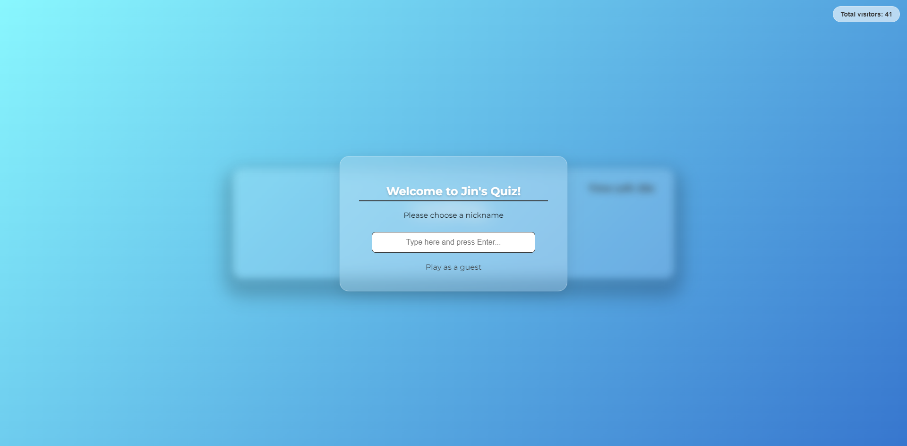
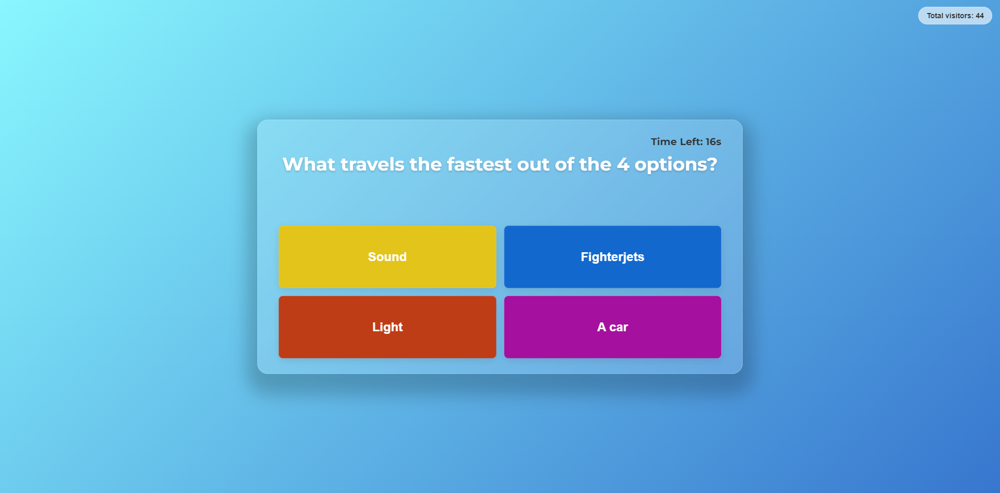
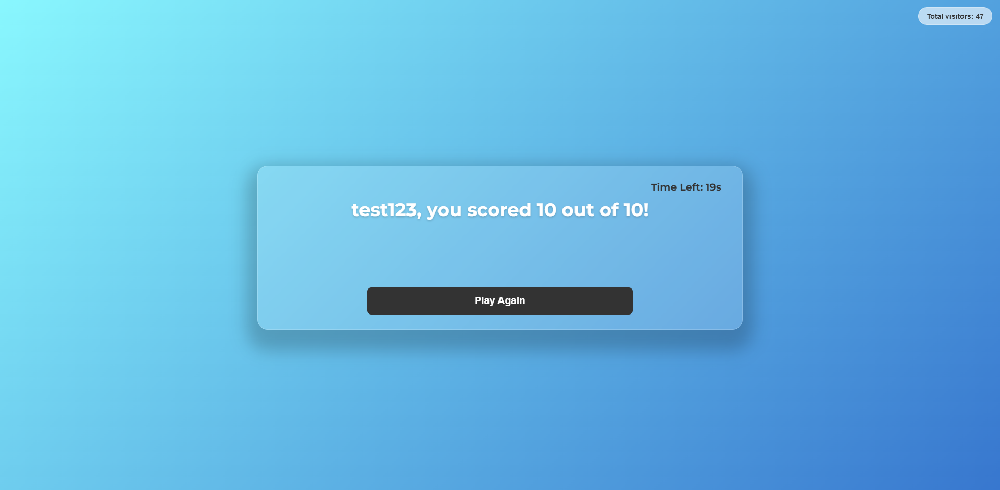
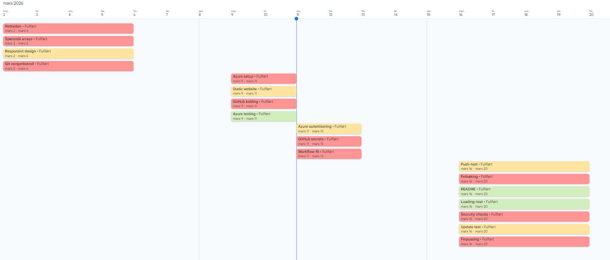
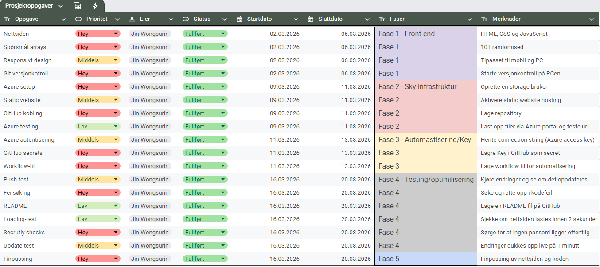

# ☁️ Cloud-Native Quiz Game.v1

A sleek, responsive web-based quiz game featuring a serverless backend and real-time visitor tracking.

## 🚀 Live Demo
<a href="https://github.com/JinW04/cloud-quiz" target="_blank" rel="noopener noreferrer">
   Live Demo
</a>

## ✨ Features
- **Dynamic Quiz Engine:** Randomized questions with a 20-second countdown timer.
- **Serverless Visitor Counter:** A live HUD element that tracks global visitors using **Azure Functions**.
- **Modern UI:** Glassmorphism design with a responsive layout optimized for mobile and desktop.
- **Nickname System:** Play as yourself or generate a fun "Cloud-Native" guest name.

## 🛠️ Tech Stack
- **Frontend:** HTML5, CSS3 (Flexbox/Grid), JavaScript (ES6+).
- **Backend:** Node.js 22 LTS on **Azure Functions**.
- **API:** RESTful API communication for real-time data fetching.
- **Deployment:** Managed via Azure Sweden Central.

## 📸 Screenshots




## 🗓️ Development Timeline
To stay organized, I mapped out the project into 5 distinct phases. This helped me track my progress from initial UI design to the finalization of the project.
Initially it was going to take 3 weeks, but it was finalized on the first half of the second week. Changes might occur in the future for this project.

### Visual Roadmap
<p align="center">
  
  <br>
</p>

### Detailed Task Breakdown
<p align="center">
  
  <br>
</p>

## 🚧 Future Features (Roadmap)
Potential features that I will be adding in the future as I continue different projects

- [ ] **Multiplayer "Quiz Rooms"**: Ability to create private rooms and compete with friends in real-time.
- [ ] **Global Leaderboard**: A persistent high-score board using a database.
- [ ] **Custom Categories**: Let users choose between different topics (Trivia, games, songs, history).
- [ ] **Sound Effects & Music**: Add immersive audio for correct/incorrect answers.

## 🔧 How to Run Locally
1. Clone the repository:
   ```bash
   git clone [https://github.com/JinW04/cloud-quiz.git](https://github.com/JinW04/cloud-quiz.git)